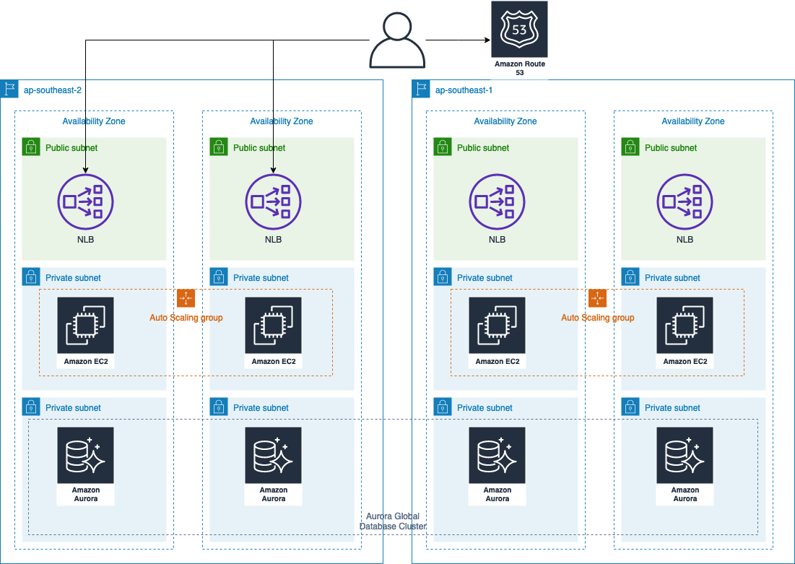

# Route53 Application Recovery Controller Demo
This is still very much a work in progress, please contact jonesaws@amazon.com with questions and/or feedback.

## Prerequisites
Public Route53 Hosted Zone

## CloudFormation Templates
## Application

`./templates/3tier_single_az_self_contained_web.yaml`

Application template, deployed into both a primary and secondary region.  The template deploys the following basic application architecture:

## Route53 Application Recovery Controller Common

`./templates/Route53-arc.yaml`

**Must be deployed into us-east-1**

This template deploys shared components including:

- S3 Bucket
- Cloudwatch Synthetics Canary
- Route53
  - Healthchecks
  - Weighted RecordSet
- Route53 Arc
  - Cluster
  - Control Panel
  - Safety Rule
  - Routing Controls
  - Recovery Group
  - Cells
  - Global ResourceSet
  - Global Readiness Check

## Route53 Application Recovery Controller Cell

`./templates/ArcCellResources.yaml`

**Must be deployed into us-east-1**

Deployed once per cell into us-east-1 and creates cell specific components including:

- Route53 Arc
  - Resource Sets
  - Readiness Checks
